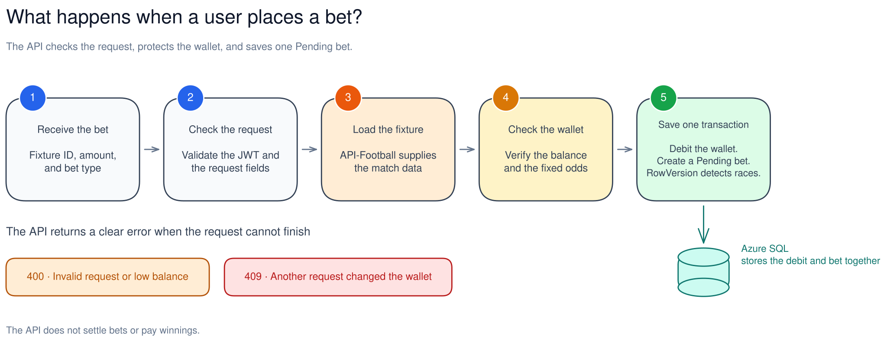
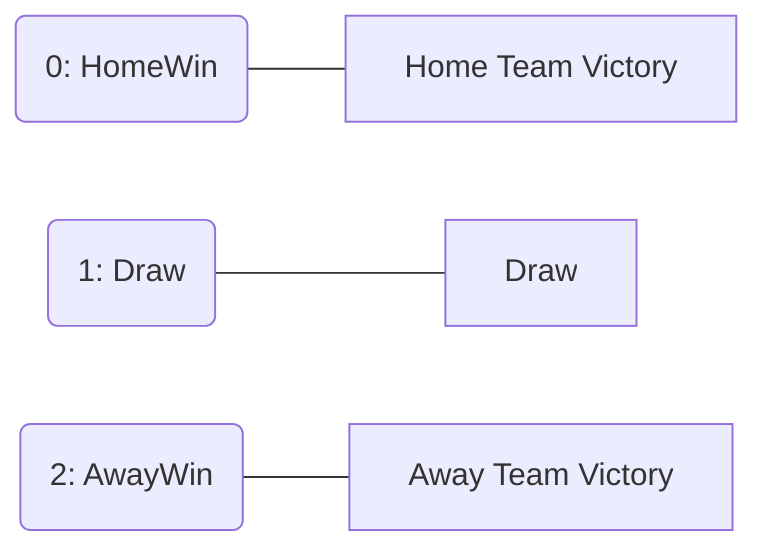

<div align="center">


# SportsBetting API
An educational sports betting API built with **.NET 10** to practise backend development,
layered architecture, authentication, persistence, validation, and concurrency control.

## Live Demo
A hosted instance runs on Azure Container Apps:
[SportsBetting API Online](https://sportsbetting-api.salmonocean-c68fcbc3.eastus2.azurecontainerapps.io/swagger/index.html)

> **Note:** Initial load might take a few seconds due to "Cold Start" (Azure scaling from zero to active).
> Swagger UI is enabled in every environment, so the link above serves the
> interactive docs directly. Locally the docs live at `/swagger` too.

</div>

## Project Overview

**Educational project** built to demonstrate .NET backend development skills. It is not
intended for production use or real-money betting.

The implemented workflow covers account management, wallet deposits, fixture lookup,
bet placement, and bet queries. It uses API-Football for fixture and team data, while
the betting odds are fixed study values defined in the application.

## Patterns & Principles

- **SOLID Standards:** Dependency Inversion, Interface Segregation, Single Responsibility
- **Separation of Concerns:** DTOs for API contracts, Use Cases for business logic
- **Domain model:** Entities and enums for users, wallets, and bets
- **Dependency Injection:** Full decoupling of layers via high-level abstractions

**Repository Pattern (Interface Segregation):**
- `IReadOnlyRepository` - Query operations
- `IWriteOnlyRepository` - Insert operations
- `IUpdateOnlyRepository` - Update operations

## Security
- **ASP.NET Core JSON Web Token (JWT) bearer authentication** — `AddAuthentication` / `AddJwtBearer`
  with `[Authorize]`, validating issuer, audience, signing key and expiration, and reading the
  standard `sub` claim
- **ASP.NET Core Identity `PasswordHasher<User>`** for password hashing and verification
- **FluentValidation** for input validation
- **Rate limiting** on login, registration, betting and wallet endpoints, partitioned per caller
- **ProblemDetails** for every error response, produced by one global exception filter
- **Strongly typed options** for JSON Web Token, API-Football and database settings, validated at
  startup with `ValidateOnStart`

## Testing
- **xUnit Tests**: Use case logic validation
- **Integration Tests** (`Integration.Test`): the registered use cases run against a real **SQL
  Server** container started by **Testcontainers**, on the schema the versioned **Entity Framework
  Core** migrations produce — this is where wallet concurrency, ledger atomicity and idempotency
  are proven
- **Web API Tests** (`WebApi.Test`): authentication, ProblemDetails, health checks, rate-limit
  partitioning and Swagger exposure through `WebApplicationFactory`
- **Validator Tests**: FluentValidation rules
- **Fluent Assertions**: Readable assertions
- **Moq** - Mocking framework
- **Bogus** - Fake data generation.

### External Services
- **API-Football (api-sports.io)** - Sports data integration

## Features

<table>
<tr>
<td width="50%" valign="top">

### User Management
- **User Registration** with email validation and password hashing.
- **JWT Authentication** with token-based authorization
- **User Profile** management with password change functionality

</td>
<td width="50%" valign="top">

### Wallet System
- **Deposit funds** — balance management with decimal precision for accurate financial calculations
- **Append-only ledger** — every credit and debit is written to `WalletTransactions` as a
  `Deposit` or `BetDebit` entry recording the resulting balance
- **Idempotent deposits and bets** via the `Idempotency-Key` header
- **Concurrent bet protection** - prevents negative balance from simultaneous bets via optimistic concurrency control

</td>
</tr>
<tr>
<td width="50%" valign="top">

### Betting System
- **Place bets** on fixtures from the configured league season (2024 La Liga by default)
- **Auto-generated event names** from Football API (example: "Manchester United vs Liverpool")
- **Fixed study odds** selected by bet type (HomeWin, Draw, AwayWin)
- **Enum based BetType** for type safety and validation (`HomeWin`, `Draw`, `AwayWin`)
- **Potential return calculation** (`Amount × Odds`)
- **Get bet by ID** with detailed information
- **Race condition prevention** via optimistic concurrency control on the wallet
- **Atomic placement** — the wallet debit, the ledger entry and the bet are written in one commit

> **Project boundary:** Bets are created with `Pending` status. The API does not fetch
> match results, settle bets, change them to won or lost, or credit winnings back to the
> wallet. `PotentialWinning` is an estimate calculated when the bet is placed.

</td>
<td width="50%" valign="top">

### Football API Integration
- Integration with **API-FOOTBALL** (api-sports.io) through `IHttpClientFactory` and
  **Microsoft.Extensions.Http.Resilience** — total and per-attempt timeouts, a circuit breaker, and
  retries on safe `GET` requests only, with exponential backoff and jitter
- Short in-memory cache of the fixture list, and upstream failures reported as `502` or `503`
- Get fixture IDs, dates, and home/away team names for the 2024 La Liga season
- User can bet for **HomeWin, Draw, and AwayWin** betting markets
- Fixed odds of `2.10`, `3.40`, and `3.80` are added locally for learning purposes

</td>
</tr>
</table>

## How a bet is placed

The diagram follows one request from the API to a `Pending` bet. It also shows where the API returns `400` or `409`.



*Editable source: [`docs/architecture.excalidraw`](docs/architecture.excalidraw) — open it on [excalidraw.com](https://excalidraw.com) to edit, then re-export the SVG.*

## Project structure

This project follows **Clean Architecture** with clear separation of concerns:

```text
SportsBetting/
├── src/
│ ├── Backend/
│ │ ├── SportsBetting.API           # Controllers, Filters, Middleware
│ │ ├── SportsBetting.Application   # Use Cases, AutoMapper, Validators
│ │ ├── SportsBetting.Domain        # Entities, Enums, Interfaces
│ │ └── SportsBetting.Infrastructure# EF Core, Repositories, External APIs
│ └── Shared/
│ ├── SportsBetting.Communication   # DTOs (Requests/Responses)
│ └── SportsBetting.Exceptions      # Custom exceptions
└── tests/
├── UseCase.Test                    # Unit tests
├── Validator.Tests                 # FluentValidation tests
├── WebApi.Test                     # HTTP-level tests (WebApplicationFactory)
├── Integration.Test                # SQL Server tests (Testcontainers)
└── CommonTestsUtilities            # Test builders
```
```mermaid
erDiagram
Users ||--|| Wallets : "1:1"
Users ||--o{ Bets : "1:N"
Wallets ||--o{ WalletTransactions : "1:N"
Bets ||--o| WalletTransactions : "0..1:1"

    EntityBase {
        bigint Id PK
        bit Active "Default: true"
        datetime2 CreatedOn 
    }

    Users {
        bigint Id PK
        nvarchar Name
        nvarchar Email UK
        nvarchar Password
        bit Active
        datetime2 CreatedOn
    }

    Wallets {
        bigint Id PK
        bigint UserId FK
        decimal Balance
        rowversion RowVersion "Optimistic Concurrency"
    }

    Bets {
        bigint Id PK
        bigint UserId FK
        int FixtureId
        decimal Amount
        decimal Odds
        decimal PotentialWinning
        int BetType
        int Status
        datetime2 PlacedAt
        nvarchar ClientRequestId "Unique per user when set"
    }

    WalletTransactions {
        bigint Id PK
        bigint WalletId FK
        bigint BetId FK "Null for deposits"
        nvarchar Type "Deposit | BetDebit"
        decimal Amount
        decimal BalanceAfter
        datetime2 OccurredAt
        nvarchar ClientRequestId "Unique per wallet when set"
    }
 ```

## Concurrency Flow (Wallet Protection)
```mermaid
sequenceDiagram
    participant User
    participant API
    participant Database
    
    User->>API: POST /Bet/place-bet (Amount: €100)
    API->>Database: SELECT Balance, RowVersion WHERE UserId = X
    Database-->>API: Balance: €500, RowVersion: 0x001
    
    Note over API: Check: €500 >= €100 ✓
    
    API->>Database: UPDATE Wallets SET Balance = €400 WHERE UserId = X AND RowVersion = 0x001
    
    alt RowVersion Matched
        Database-->>API: Success (RowVersion now 0x002)
        API-->>User: 201 Created - Bet Placed
    else RowVersion Changed (Concurrent Bet)
        Database-->>API: 0 rows affected
        API-->>User: 409 Conflict - "Another bet was placed simultaneously"
    end
```

## Enum & Mappings



## Tech Stack

- **.NET 10** / **C# 14**
- **ASP.NET Core** - Web API
- **Entity Framework Core** - ORM with SQL Server
- **SQL Server** - Relational database
- **AutoMapper** - Object-to-object mapping
- **FluentValidation** - Request validation
- **JSON Web Token (JWT)** - Authentication, via ASP.NET Core JWT bearer
- **Microsoft.Extensions.Http.Resilience** - Timeouts, circuit breaker and retries for API-Football
- **Swagger** - API documentation
- **Docker** and **Docker Compose** - Containerised SQL Server, migrations and API
- **Testcontainers** - SQL Server for the integration tests
- **API-Football (api-sports.io)** - External fixture and team data


## Technical Highlights (Betting - Wallet)

### Optimistic Concurrency Control
Prevents race conditions in wallet operations using **RowVersion**:
```csharp
// Wallet entity with version tracking
public byte[] RowVersion { get; set; } = [];

// EF Core carries the token in the UPDATE's WHERE clause
builder.Property(w => w.RowVersion).IsRowVersion();

// UnitOfWork translates the EF failure into a domain exception the API maps to 409
catch (DbUpdateConcurrencyException)
{
    throw new ConcurrencyException();
}
```

**How it works:**
- SQL Server updates `RowVersion` automatically on each change
- EF Core validates version in `WHERE` clause: `WHERE Id = X AND RowVersion = @value`
- The balance is re-checked on the tracked read immediately before the deduction, so a bet
  that arrives after another request spent the balance is refused with `400` insufficient
  balance instead of driving the wallet negative
- Concurrent updates trigger `DbUpdateConcurrencyException`
- The loser gets `409 Conflict`: *"Another bet was placed simultaneously. Please try again"* — a retryable
  conflict, not a validation error, and the winning balance is never overwritten
- Covered by `PlaceBetUseCaseTests.ShouldPersistNothingWhenTheWalletMovedUnderTheRequest`, which
  drives the registered use case against a real SQL Server container and commits a competing debit
  in the instant before the write

**Testing:** `dotnet test tests/Integration.Test` runs these against SQL Server; Docker must be
running because the container is started by Testcontainers.

**Fixture details and fixed study odds are server controlled** - users can only specify
`fixtureId`, `amount`, and `betType`. There is no payout or settlement workflow.

## Prerequisites
- .NET 10 SDK
- SQL Server (or Docker, which the Compose stack starts for you)
- Docker — required to run `tests/Integration.Test`, which starts SQL Server through Testcontainers
- API-Football account and key from [api-sports.io](https://api-sports.io) (direct plan, not the RapidAPI gateway)
- Visual Studio or JetBrains Rider (developed with Rider, recommended for this project)
- Postman or Swagger for API testing

## Setup Instructions

### Docker & Cloud Deployment

This project is fully containerized and engineered to run in scalable cloud environments.

#### Local execution with Docker Compose
Compose brings up SQL Server, applies the Entity Framework Core migrations as a separate step, and
only then starts the API:

```bash
cp .env.example .env      # then edit the secrets it lists
docker compose up --build
```

The stack has three services:

| Service | Purpose |
| :--- | :--- |
| `sqlserver` | SQL Server 2022, with a health check the other services wait on |
| `migrator` | Runs an Entity Framework Core migration bundle to completion, then exits |
| `api` | Starts only after `migrator` succeeds; runs as a non-root user with its own health check |

Migrations are never applied by the API at startup — the `migrator` service is the deployment step.
The API answers on `http://localhost:8080` by default (`API_HOST_PORT` in `.env`).

To build just the API image:

```bash
docker build --target runtime -t sportsbetting-api .
docker run -p 8080:8080 --env-file .env sportsbetting-api
```

### 1. Clone Repository
```bash
git clone https://github.com/DeVFirmino/SportsBetting.git
cd SportsBetting

```

### 2. Configure Database Connection
Create `src/Backend/SportsBetting.API/appsettings.Development.json` (the file is gitignored):
```json
{
  "ConnectionStrings": {
    "DefaultConnection": "Server=(localdb)\\mssqllocaldb;Database=SportsBetting;Trusted_Connection=true;TrustServerCertificate=true"
  }
}
```

### 3. Configure Secrets and Football API
Get your API key from [API-Football](https://api-sports.io) (the code calls the direct
`v3.football.api-sports.io` endpoint with the `x-apisports-key` header) and add a `Settings`
section to `appsettings.Development.json`:
```json
{
  "Settings": {
    "Jwt": {
      "SigningKey": "your-secret-key-min-32-characters-long",
      "Issuer": "sportsbetting-api",
      "Audience": "sportsbetting-clients",
      "ExpirationTimeMinutes": 60
    },
    "FootballApi": {
      "BaseUrl": "https://v3.football.api-sports.io",
      "ApiKey": "YOUR_API_FOOTBALL_KEY_HERE",
      "CacheSeconds": 30,
      "RetryDelayMilliseconds": 500
    }
  }
}
```

Every one of these is bound to a typed options class and validated with `ValidateOnStart`, so a
missing connection string, a signing key under 32 characters, an empty issuer or audience, or a
malformed API-Football base URL stops the application while it is starting rather than on the
first request that needs the value.

### 4. Run Database Migrations
The design-time factory takes its connection string from the environment, so nothing is hardcoded
in source:

```bash
export SPORTSBETTING_EF_CONNECTION="Server=(localdb)\\mssqllocaldb;Database=SportsBetting;Trusted_Connection=true;TrustServerCertificate=true"

dotnet ef database update \
  --project src/Backend/SportsBetting.Infrastructure \
  --startup-project src/Backend/SportsBetting.Infrastructure
```

Under Docker Compose this step is the `migrator` service instead, which runs a migration bundle.

**Migrations include:**
- Initial schema (Users, Wallets, Bets)
- RowVersion for Wallet concurrency control
- BetType enum conversion
- FixtureId index on Bets
- `WalletTransactions` ledger, `Bets.ClientRequestId`, and the filtered unique indexes behind
  idempotency (`AddWalletLedgerAndIdempotency`)

### 5. Run Application
```bash
dotnet run
```

**URLs:**
- **HTTP**: `http://localhost:5055` (the launch profile serves HTTP only)
- **Swagger**: `http://localhost:5055/swagger`
- **Liveness**: `http://localhost:5055/health/live`
- **Readiness**: `http://localhost:5055/health/ready` (reaches SQL Server)

### 6. Run the tests
```bash
dotnet build
dotnet test                        # every project; Integration.Test needs Docker running
dotnet test tests/UseCase.Test     # unit tests only, no Docker required
```
---

## API Endpoints  

### Authentication
| Method | Endpoint | Description | Auth Required |
| :--- | :--- | :--- | :--- |
| POST | `/User/register` | Register a new user account | No |
| POST | `/Login` | Authenticate and retrieve JWT token | No |
| GET | `/User` | Retrieve the authenticated user profile | Yes |
| PUT | `/User` | Update the authenticated user's name and email | Yes |
| PUT | `/User/change-password` | Update account password | Yes |

### Wallet Management
| Method | Endpoint | Description | Auth Required |
| :--- | :--- | :--- | :--- |
| POST | `/Wallet/deposit` | Add funds to the user's wallet (accepts `Idempotency-Key`) | Yes |
| GET | `/Wallet` | Check current wallet balance | Yes |

> **Note:** Add balance to your wallet before placing a bet on a fixture.

### Betting Operations
> **Important:** Get a `fixtureId` from `/Fixtures` before placing bets.


| Method | Endpoint | Description | Auth Required |
| :--- | :--- | :--- | :--- |
| POST | `/Bet/place-bet` | Place a new bet on a fixture (accepts `Idempotency-Key`) | Yes |
| GET | `/Bet/get-bets` | Retrieve all bets placed by the user | Yes |
| GET | `/Bet/{id}` | Retrieve details of a specific bet | Yes |

### Fixtures and Odds
| Method | Endpoint | Description | Auth Required |
| :--- | :--- | :--- | :--- |
| GET | `/Fixtures` | Get fixture data with fixed study odds | Yes |

## API Bet Documentation

### Authentication Endpoints

> Once registered, place the JWT token in Swagger's Authorize dialog, e.g. `Bearer eyJhbGciOiJIUzI1NiIsInR5cCI6Ik...`

**Register User**
```http
POST /User/register
Content-Type: application/json

{
  "name": "Cristiano Ronaldo",
  "email": "cr7@portugal.com",
  "password": "SiuuuCR7!"
}
```

**Login**
```http
POST /Login
Content-Type: application/json

{
  "email": "cr7@portugal.com",
  "password": "SiuuuCR7!"
}
```

### Wallet Endpoints

**Deposit Funds**
```http
POST /Wallet/deposit
Authorization: Bearer {jwt_token}
Idempotency-Key: 6f1c2d64-0f2e-4a1f-9a53-0b6c2f2d9a11

{ "amount": 959.00 }
```

**Get Balance**
```http
GET /Wallet
Authorization: Bearer {jwt_token}
```

### Betting Endpoints

**Get Fixtures**
```http
GET /Fixtures
Authorization: Bearer {jwt_token}
```

**Place Bet**
```http
POST /Bet/place-bet
Authorization: Bearer {jwt_token}
Idempotency-Key: 6f1c2d64-0f2e-4a1f-9a53-0b6c2f2d9a11

{
  "fixtureId": 12345,
  "amount": 70.00,
  "betType": "HomeWin"  // Options: HomeWin, Draw, AwayWin
}
```

**Get User Bets**
```http
GET /Bet/get-bets
Authorization: Bearer {jwt_token}
```

**Get Bet by ID**
```http
GET /Bet/{id}
Authorization: Bearer {jwt_token}
```

### Quick Start Workflow

1. **Register** → Receive JWT token
2. **Deposit funds** → Add balance to wallet
3. **Get fixtures** → View available matches with odds
4. **Place bet** → Select fixture, amount, and bet type


### Idempotency

`POST /Wallet/deposit` and `POST /Bet/place-bet` accept an optional `Idempotency-Key` header of at
most 128 characters; a longer one is rejected with `400`. Send the same key again and the request
is replayed rather than repeated:

- the bet endpoint returns the bet already stored under that key;
- the deposit endpoint credits the balance once and answers `204` again.

A replay must carry the same payload the key was stored under: reusing a key with a different
amount, fixture or bet type — or reusing a bet's key for a deposit — is rejected with `400`
instead of answering as if the new payload had been applied.

The key is unique per user for bets and per wallet for ledger entries, enforced by filtered unique
indexes in SQL Server. That covers the concurrent case too: when two requests carrying the same key
overlap, the loser — whether it collides with the unique index or loses the wallet's rowversion to
the winner's write — re-reads the winner and returns it, instead of failing.
Omitting the header opts out — repeated calls then create separate bets and separate deposits.

### Health checks

| Endpoint | Reports |
| :--- | :--- |
| `GET /health/live` | The process is running |
| `GET /health/ready` | The process can reach SQL Server |

### Rate limits

Each policy uses a one-minute fixed window. Betting and wallet windows are partitioned by the
authenticated `sub` claim; login and registration are partitioned by client address only, so a
token cannot buy a fresh brute-force allowance. Forwarded headers are honoured (the demo runs
behind a platform proxy), which keeps the address partitions from collapsing into one shared
bucket.

| Endpoint | Requests per minute |
| :--- | :--- |
| `POST /Login` | 5 |
| `POST /User/register` | 5 |
| `POST /Bet/place-bet` | 10 |
| `POST /Wallet/deposit` | 10 |

Exceeding a window returns `429`.

### Error Codes

Every error is returned as an ASP.NET Core `ProblemDetails` body, with the messages under an
`errors` extension member:

- `400` - Validation error, insufficient balance, bet/fixture/wallet not found, or an
  `Idempotency-Key` longer than 128 characters
- `401` - Unauthorized (invalid/missing token or invalid login)
- `409` - Concurrent bet conflict
- `429` - Rate limit exceeded
- `502` / `503` - API-Football answered with a failure, was unreachable, or the circuit is open
- `500` - Unexpected server error

---

## Author

<table>
  <tr>
    <td align="center">
      <a href="https://github.com/DeVFirmino">
        <br>
         <sub>
          <b>Daniel Dias</b>
        </sub>
      </a>
    </td>
    <td>
      <p><strong>Daniel Dias</strong> </p>
      <p>Backend developer C# and .NET with a focus on building real-world APIs</p>
      <p>
        <a href="https://www.linkedin.com/in/daniel-dias-504168113/">
          
        </a>
        <a href="https://github.com/DeVFirmino">
          
        </a>
        <a href="mailto:daanspfc@gmail.com">
          
        </a>
      </p>
    </td>
  </tr>
</table>

<div align="center"> <strong>
Developed for practice & portfolio purposes</strong>
<i>Not for commercial use</i> </div>
