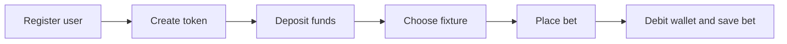

# SportsBetting API

A small sports betting API I use to practise backend development with .NET 10.
The project focuses on one complete workflow: a user deposits funds, chooses a
football fixture and places a bet.

This is an educational project. It does not process real money, settle matches
or pay winnings.

## What it demonstrates

- REST endpoints with ASP.NET Core controllers
- JWT authentication and ASP.NET Core password hashing
- business rules kept in explicit use cases
- SQL Server persistence with Entity Framework Core
- optimistic concurrency on wallet updates
- idempotent bet placement
- an external football API through `IHttpClientFactory`
- unit, HTTP and SQL Server integration tests
- Docker Compose with an explicit migration step

## Main flow



When a bet is placed, the API:

1. validates the request and `Idempotency-Key` header;
2. returns the stored result if the same request was already completed;
3. loads the chosen fixture and its server-owned odds;
4. verifies the authenticated user's wallet balance;
5. debits the wallet and saves the bet in one database commit.

The public contract calls the three available markets `HomeWin`, `Draw` and
`AwayWin`. Swagger presents them as text choices, so there is no numeric enum or
undocumented string to guess.

## API

| Method | Route | Purpose |
|---|---|---|
| `POST` | `/users` | Register a user and create their wallet |
| `POST` | `/tokens` | Exchange email and password for a JWT |
| `GET` | `/users/me` | Read the authenticated user's profile |
| `PUT` | `/users/me` | Update the profile |
| `PUT` | `/users/me/password` | Change the password |
| `GET` | `/wallet` | Read the current balance |
| `POST` | `/wallet/deposits` | Add study funds to the wallet |
| `GET` | `/fixtures` | List the first ten fixtures of the configured league season |
| `POST` | `/bets` | Place an idempotent bet |
| `GET` | `/bets` | List the authenticated user's bets |
| `GET` | `/bets/{id}` | Read one owned bet |

All routes except registration and token creation require a bearer token.
Registration and token creation are rate-limited per client address.

### Place a bet

Send a unique `Idempotency-Key` header with a maximum of 128 characters:

```http
POST /bets
Authorization: Bearer <token>
Idempotency-Key: portfolio-demo-001
Content-Type: application/json

{
  "fixtureId": 123,
  "stake": 25.00,
  "market": "HomeWin"
}
```

The fixture name and odds come from the server. The response includes the stake,
odds and potential return. Repeating the same key and payload returns the first
bet without charging the wallet again. Reusing the key with a different payload
returns `409 Conflict`.

## Domain boundaries

The persisted model deliberately has only three concepts:

- `User`: credentials and profile data;
- `Wallet`: the user's current study balance and concurrency token;
- `Bet`: the fixture, market, stake, odds and potential return captured at
  placement time.

There is no transaction ledger, bet settlement engine or administrator flow.
Those concepts would add code without improving the portfolio story this
repository is meant to tell.

The short domain glossary lives in [`CONTEXT.md`](CONTEXT.md).

## Concurrency and idempotency

`Wallet.RowVersion` is an SQL Server `rowversion`. Entity Framework includes it
in the wallet update, so two requests cannot silently spend the same balance.

Bet idempotency is also enforced by a unique database index over user and key.
The use case makes the replay behaviour visible, while the infrastructure layer
translates only the relevant database conflicts. This protects both sequential
retries and requests that arrive at the same time.

## Football data

`GET /fixtures` uses API-Football for fixture and team data. It reads one fixed
league season, La Liga 2024 by default, configured through `Settings:FootballApi`
(`Season` and `LeagueId`), and returns the first ten fixtures the provider lists.
The list is not filtered by date: it is a stable catalogue for exercising the
betting flow, not a live schedule. The integration has a configured timeout and a
short in-memory cache. Upstream failures are exposed
as `502` or `503` Problem Details responses.

Betting odds are fixed study values owned by this application. `IOddsService`
is the single place that prices a market; its `FixedOddsService` implementation
offers every fixture at the same odds. A client chooses the market, but it
cannot submit or override the odds.

## Project structure

```text
src/
├── Backend/
│   ├── SportsBetting.API             # HTTP endpoints and API configuration
│   ├── SportsBetting.Application     # use cases, validation and mapping
│   ├── SportsBetting.Domain          # entities and repository contracts
│   └── SportsBetting.Infrastructure  # EF Core and football API access
└── Shared/
    ├── SportsBetting.Communication   # request and response contracts
    └── SportsBetting.Exceptions      # application error contract

tests/
├── UseCase.Test                      # isolated business behaviour
├── Validator.Tests                   # request validation
├── WebApi.Test                       # routes, auth, errors and OpenAPI
├── Integration.Test                  # real SQL Server behaviour
└── CommonTestsUtilities              # focused test builders
```

The projects preserve clear dependency boundaries, but the request path remains
ordinary: controller → use case → repository or external service.

## Run with Docker Compose

Prerequisites:

- Docker Desktop or another Docker-compatible runtime
- an API-Football key

Create the local environment file:

```bash
cp .env.example .env
```

Set `MSSQL_SA_PASSWORD`, `JWT_SIGNING_KEY` and `FOOTBALL_API_KEY`, then run:

```bash
docker compose up --build
```

Compose starts SQL Server, runs the versioned Entity Framework migration bundle
and starts the API only after the migration succeeds.

Open Swagger at <http://localhost:8080/swagger>.

The local database port defaults to `1434`, which avoids taking the usual SQL
Server port from an existing installation. Both published ports can be changed
in `.env`.

## Build and test

The repository targets the .NET 10 SDK:

```bash
dotnet build SportsBetting.sln
dotnet test SportsBetting.sln --no-build
```

The five integration tests require Docker because they start a disposable SQL
Server with Testcontainers. They cover the database behaviours that matter most:

- registration persists the user and wallet together;
- placement debits the wallet and saves the bet together;
- replaying an idempotency key does not debit twice;
- concurrent requests with the same key create one bet;
- concurrent requests with different keys cannot overdraw the wallet.

Run only that suite with:

```bash
dotnet test tests/Integration.Test/Integration.Test.csproj
```

## Technology

- .NET 10 and C#
- ASP.NET Core Web API
- Entity Framework Core and SQL Server
- AutoMapper and FluentValidation
- JWT bearer authentication
- Swagger / OpenAPI
- xUnit, FluentAssertions and Testcontainers
- Docker and Docker Compose

## Intentional trade-offs

This API is sized for learning and portfolio review, not production betting.
Deposits create study funds, odds are static, fixtures are read-only and bets do
not transition after placement. The code still protects the two behaviours
where correctness is worth demonstrating: wallet concurrency and safe request
retries.
